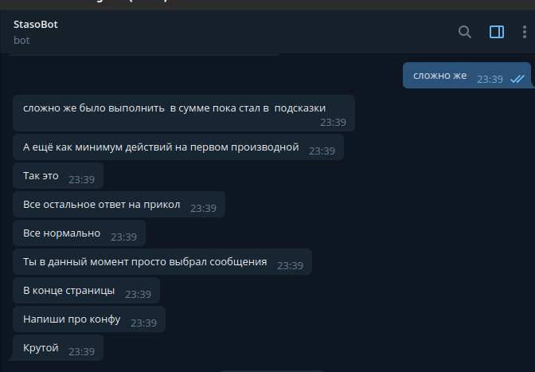
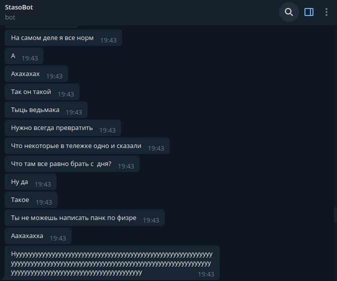
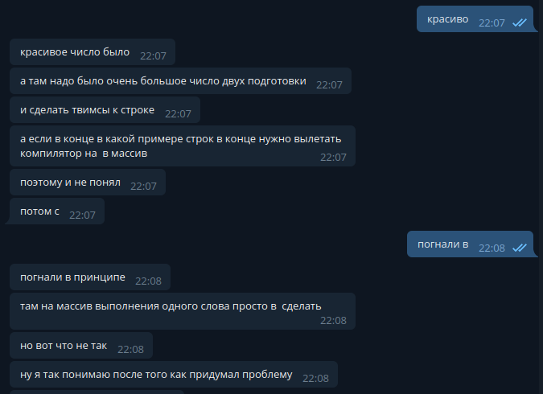
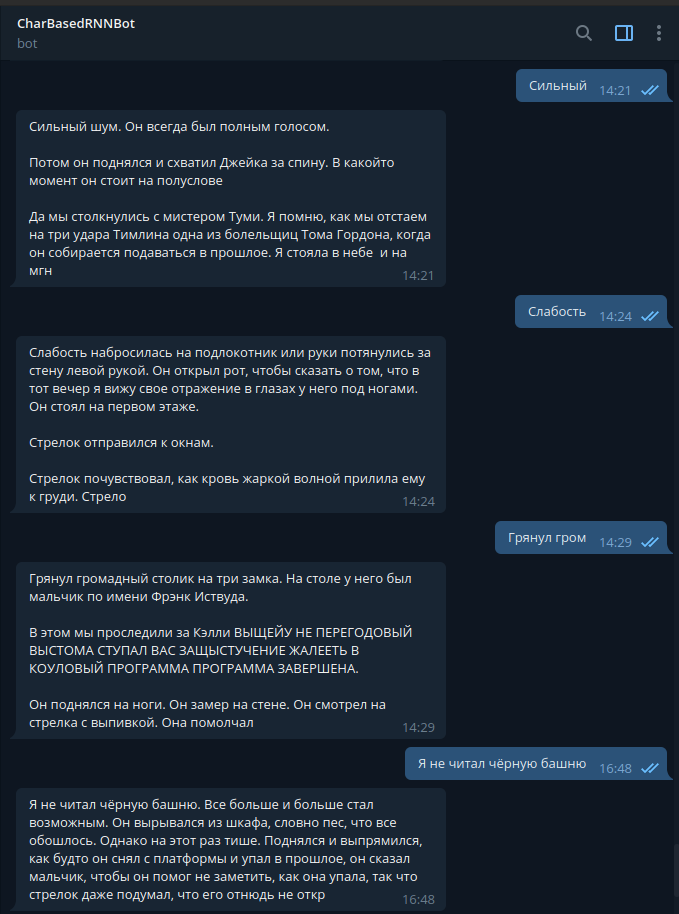

# Telegram-bot to simulate my friend's messages. Uses char-based prediction using RNNs.

### Is made in purpose of entertainment :)

This project was made to
test [char-based RNN models](https://www.google.com/search?q=char+based+prediction+models+rnn&oq=char+based+prediction+models+rnn)
in order to have some fun. Then I've wrapped the model with a Telegram-bot and had some great time
with my friends interacting with different models trained on different data.

Being precise, char model described in char_RNN.ipynb has nothing to do with telegram or my friends:
it's just a language model based on LSTM block which predicts next character based on a given input
sequence. If we do it repeatedly, we get a very simple text generation model, which has a pure
statistical nature. If we add some special symbol to denote the end of the message, we get a model
generating telegram messages :).

For more information on model's structure and data preparation see char_RNN.ipynb and
data_prep.ipynb

### Warning

This project is posted to Github in a "presentation mode", which means, the repo is just a ready
made project pushed to the master branch :). It is currently off, so if you'd like to see it
working, you may look at pictures below or launch it yourself by configuring environment variables
as in dummy_env. In last case, you need to train model using your data in .txt format, save it as
my_model.pth and provide path to it as in dummy_env file.

It's also a bit messy as I was not really caring about clean bot code or comments, so TODO: clear
bot's code up.

TODO: all examples provided here are in russian as I've experimented only in that language. I will
post english examples here soon as well.

### Options

You can configure generated text length and temperature. To see, what the last one means, see
char_RNN.ipynb. Generally speaking, the higher the temperature--the more likely model will generate
the most frequent letter (-> phrases)
used by someone and will have no variety in generated texts. On the other hand, low temperature
might produce absolute rubbish. So, it's tunable on the user level.

## What I've tried

### Exported messages from telegram chats and groups

Telegram legally has a feature of exporting history to json. So, after some cleaning we get a
portion of data to simulate one's texting style.

It didn't work perfectly, as the model is too simple and data is not that various. But it
transferred one's style perfectly. So, it is weird but still fun :). Here are some examples in
russian.

Friend #1

<div align="center">

|  |  |
| --- | --- |

</div>

Friend #2



Basically, model has overfitted on last discussed topics in the chat, but the style is great :)

### Shtirliz jokes (found online by hand)

I had a very low amount of that (58 KB), so the model has severely overfitted. It just mixed the
beginning of the joke with its end.

```
Штирлиц вышел из дома и увидел, что Плейшнер о чемто оживленно разговаривает с дворниками. "Свинной грипп"  подумал Штирлиц.

Штирлиц вышел из дома и увидел, что Плейшнер о чемто оживленно разговаривает с дворниками. "Совсем рехнулся пастор",  подумал Штирлиц

Штирлиц вышел из дома и увидел, что Плейшнер о чемто оживленно разговаривает с дворниками. "Студент, какой стеснительный"  догадался Штирлиц."

Штирлиц, у вас есть план?
 Это Штирлиц, сейчас будет драка,"  подумал Штирлиц.
 
 Мюллер вышел из кабака и ктото больно ударил его по затылку. 
Об этом он узнал из утренних газет
```

### Stephen King stories

This data (3.6 MB) was the best to mess with. Produced texts had a lot of variety, saved some kind
of context and even were a bit creepy. Here are the examples of bot interaction in russian:



It clearly took some ready-made parts of the text, but had a great variance in text results.
Although, there was no big sense in these words as the model still remained to be simple as a
stick :)

#### Lord of The Rings stories
#### Russian Classical literature

Last ones produced similar results to Stephen King stories, but were not that funny and creepy.


### If you want to try it...

You should find some text data you want your model to be trained on and define the alphabet it
should be using. For example, I've trained some models in russian language (so i've defined russian
alphabet in both bot and model) using my friends' telegram messages (so i've exported them). To feed
your model with data, just simply organize it into one txt file and see char_RNN.ipynb.

Then, if you've saved your model in .pth format, configure environment and launch the bot :)


### TODO

* Clean up bot's code
* Comment and reorganize .ipynb files
* Provide examples in english.


### Important note

Have a nice day :)